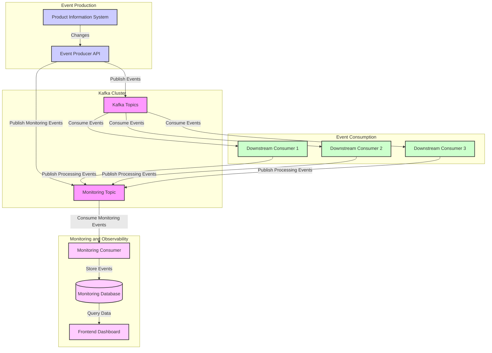
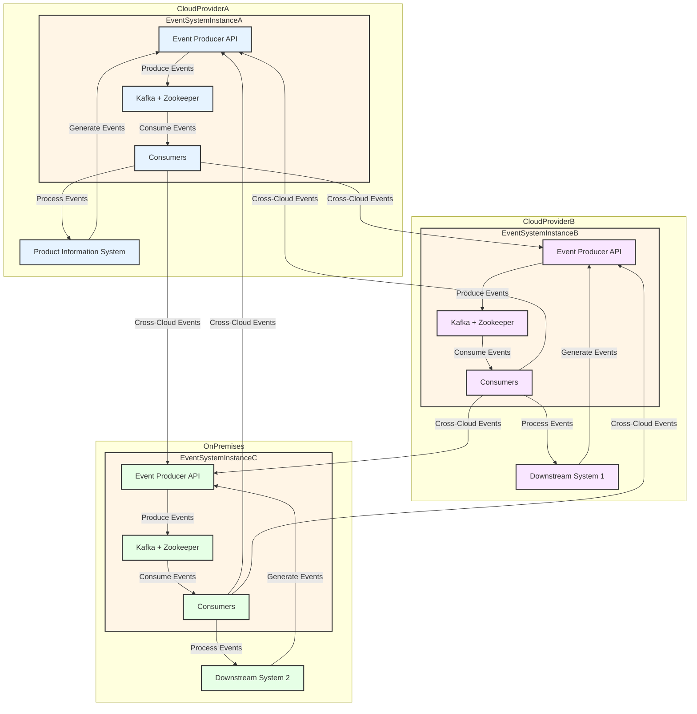

# Scalable and Resilient Event-Based Message Exchange System for Real-Time Product Information Updates




## 1. System Overview

Imagine you've got a product catalog that's always changing. Our system grabs those changes, turns them into events, and shoots them off to whoever needs to know about them. 

## 2. Architecture Components

### 2.1 Product Information System
- Where it all starts - the source of all our product updates

### 2.2 Event Producer API
- The messenger (built with FastAPI) - it's got HTTP endpoints for manual event creation and supports automatic event capture through Change Data Capture (CDC)


### 2.3 Apache Kafka Cluster
- The backbone of our operation - they handle all the message brokering and cluster management

### 2.4 Downstream Consumers
- The listeners who act on the news - they're customizable for different business needs

### 2.5 Monitoring Consumer
- Our watchful eye - it keeps track of all the system events

### 2.6 Frontend Dashboard
- Where we can see what's happening - it gives us real-time insights into our system's health

## 3. Data Flow

1. Changes originate in the Product Information System.
2. The Event Producer API captures these changes and publishes them to appropriate Kafka topics.
3. Upon successful event publication, the Event Producer API adds a monitoring event to a dedicated monitoring topic.
4. Multiple downstream consumers subscribe to relevant topics and process the events.
5. After successful processing, each consumer adds a monitoring event to the monitoring topic.
6. The Monitoring Consumer reads from the monitoring topic and stores events in a database.
7. The Frontend Dashboard queries the monitoring database to display system metrics and event processing status.

## 4. Key Features

### 4.1 Scalability
- Kafka's distributed nature allows for horizontal scaling of brokers and consumers.
- Multiple consumers can be added to handle increased load.

### 4.2 Resilience
- Kafka's replication factor ensures data durability.
- Zookeeper manages the Kafka cluster, handling broker failures.
- Consumers can be easily restarted without data loss due to Kafka's offset management.

### 4.3 Real-time Processing
- Event-driven architecture ensures near real-time updates.
- Low-latency message passing through Kafka topics.

### 4.4 Observability
- Dedicated monitoring topic and consumer for tracking system health.
- Frontend dashboard for real-time visibility into event processing.

## 5. Deploying / Running The Code

## Prerequisites

- Docker and Docker Compose installed on your system
- Git 

## Setup and Running

1. Clone the repository (if applicable):
   ```
   git clone https://github.com/rahulreddy15/assignment.git
   cd assignment
   ```

2. Build and start the services:
   ```
   docker-compose up --build
   ```

3. Access the services:
   - Event Producer API: http://localhost:8000
   - Monitoring Dashboard: http://localhost:7070
   - Monitoring Frontend: http://localhost:8080

4. To stop the services, use:
   ```
   docker-compose down
   ```

# Multi-Hybrid Cloud Implementation

## Reusable Component Architecture

Our event-based system is designed as a reusable, self-contained unit for deployment across multiple cloud environments. Each system (Product Information System or downstream systems) deploys and configures its own instance of this packaged system. This package includes:

1. Event Producer API
2. Apache Kafka
3. Zookeeper
4. Consumers (including the Monitoring Consumer)

The event system is placed before each cloud service system, acting as an intermediary layer for event processing and distribution.

## Multi-Hybrid Cloud Architecture Diagram




## System Configuration and Scalability

### Configurability

1. **Environment-Specific Settings**: Configure each instance with environment-specific settings through environment variables or configuration files.
2. **Topic Management**: Dynamically create and manage Kafka topics based on system needs.
3. **Consumer Customization**: Customize consumers for specific needs while maintaining core functionality.
4. **Monitoring Adaptation**: Adapt the monitoring system to integrate with cloud-native monitoring solutions.
5. **Inter-Cloud Communication**: Configure secure communication channels between different cloud environments.

### Scalability and Advantages

1. **Independent Scaling**: Scale each instance independently based on specific environment requirements.
2. **Cloud Vendor Flexibility**: Easily migrate between cloud providers or adopt multi-cloud strategies.
3. **Consistent Programming Model**: Maintain a uniform system across different environments.
4. **Optimal Resource Utilization**: Optimize resource allocation based on specific workloads and pricing models.

## Implementation Considerations

1. **Event Routing**: Implement intelligent routing for cross-environment event processing.
2. **Data Synchronization**: Develop strategies for maintaining data consistency across instances.
3. **Security**: Implement end-to-end encryption and robust authentication for inter-cloud communication.
4. **Monitoring and Observability**: Create a centralized monitoring solution for a holistic system view.

Got questions? Hit me up! Happy messaging! 🚀🚀🚀🚀🚀🚀
