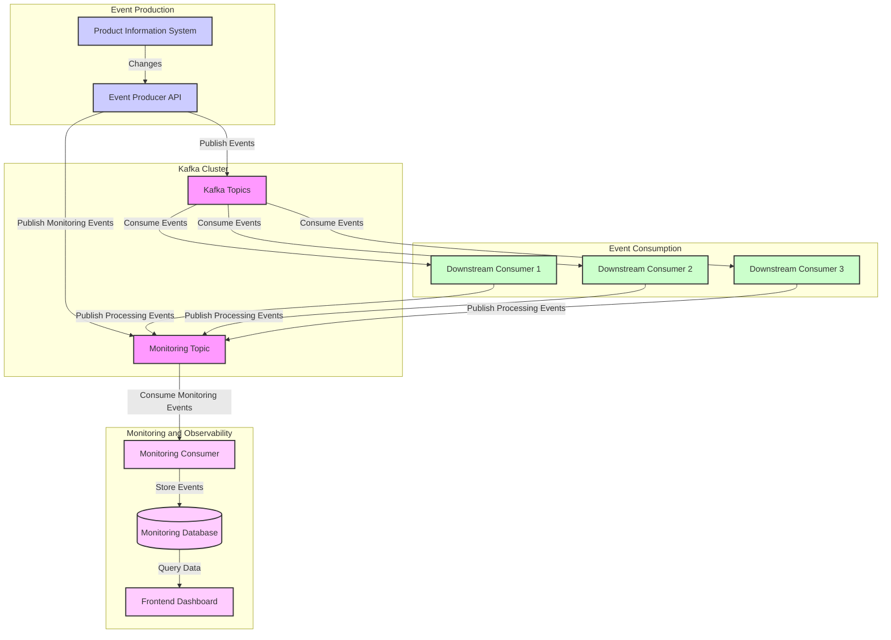
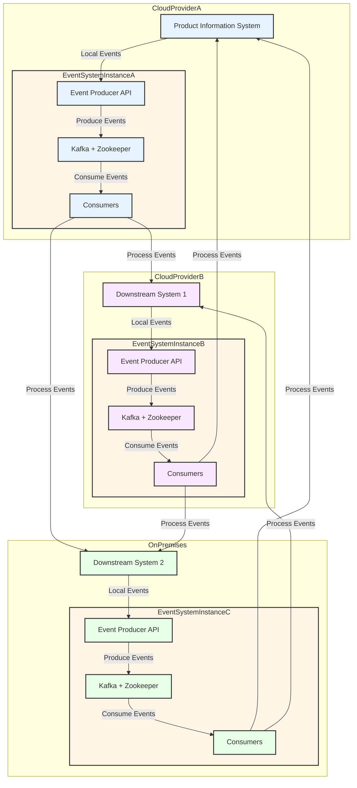

# Scalable and Resilient Event-Based Message Exchange System for Real-Time Product Information Updates

This diagram illustrates the architecture of our Event-Based Message Exchange System for Real-Time Product Information Updates. Here's a brief overview of the components:

1. **Event Production**: 
   - Product Information System: Source of changes
   - Event Producer API: Captures changes and publishes events to Kafka

2. **Kafka Cluster**: 
   - Kafka Topics: Store and distribute events
   - Monitoring Topic: Special topic for system monitoring events

3. **Event Consumption**:
   - Multiple Downstream Consumers: Process events from Kafka topics

4. **Monitoring and Observability**:
   - Monitoring Consumer: Processes monitoring events
   - Monitoring Database: Stores monitoring data
   - Frontend Dashboard: Provides system observability

The color coding helps to distinguish different functional areas of the system:
- Purple: Kafka Cluster
- Blue: Event Production
- Green: Event Consumption
- Pink: Monitoring and Observability

## 1. System Overview

This document describes the architecture and components of our Scalable and Resilient Event-Based Message Exchange System, designed for real-time product information updates. The system utilizes Apache Kafka as its core messaging technology to ensure high throughput, scalability, and fault tolerance.

## 2. Architecture Components

### 2.1 Product Information System
- The primary source of product information changes.
- Serves as the origin for all update events in the system.

### 2.2 Event Producer API
- Implemented as a FastAPI server.
- Responsible for adding change events to Kafka topics.
- Provides HTTP endpoints for manual event creation.
- Supports automatic event creation through Change Data Capture (CDC).

### 2.3 Apache Kafka Cluster
- Core message broker of the system.
- Uses Zookeeper for cluster management.
- Topics are created dynamically based on environment variables in the docker-compose file.

### 2.4 Downstream Consumers
- Multiple services that subscribe to relevant Kafka topics.
- Process events according to their specific functions.

### 2.5 Monitoring Consumer
- Specialized consumer subscribed to the monitoring topic.
- Stores monitoring events in a database for observability.

### 2.6 Frontend Dashboard
- Provides visual representation of product information updates.
- Displays data from the monitoring database for system observability.

## 3. Data Flow

1. Changes originate in the Product Information System.
2. The Event Producer API captures these changes and publishes them to appropriate Kafka topics.
3. Upon successful event publication, the Event Producer API adds a monitoring event to a dedicated monitoring topic.
4. Multiple downstream consumers subscribe to relevant topics and process the events.
5. After successful processing, each consumer adds a monitoring event to the monitoring topic.
6. The Monitoring Consumer reads from the monitoring topic and stores events in a database.
7. The Frontend Dashboard queries the monitoring database to display system metrics and event processing status.

## 4. Key Features

### 4.1 Scalability
- Kafka's distributed nature allows for horizontal scaling of brokers and consumers.
- Multiple consumers can be added to handle increased load.

### 4.2 Resilience
- Kafka's replication factor ensures data durability.
- Zookeeper manages the Kafka cluster, handling broker failures.
- Consumers can be easily restarted without data loss due to Kafka's offset management.

### 4.3 Real-time Processing
- Event-driven architecture ensures near real-time updates.
- Low-latency message passing through Kafka topics.

### 4.4 Observability
- Dedicated monitoring topic and consumer for tracking system health.
- Frontend dashboard for real-time visibility into event processing.

## 5. Component Details

### 5.1 Event Producer API
- **Technology**: FastAPI
- **Functions**:
  - Expose HTTP endpoints for manual event creation
  - Integrate with Product Information System for automatic event capture
  - Publish events to Kafka topics
  - Create monitoring events for successful publications

### 5.2 Apache Kafka and Zookeeper
- **Configuration**: Docker-compose file with environment variables for topic creation
- **Topics**: 
  - Product update topics (potentially multiple based on event types)
  - Monitoring topic

### 5.3 Downstream Consumers
- Subscribe to relevant Kafka topics
- Process events based on business logic
- Publish monitoring events upon successful processing

### 5.4 Monitoring Consumer
- Subscribes exclusively to the monitoring topic
- Stores events in a database for analysis and display

### 5.5 Frontend Dashboard
- Queries the monitoring database
- Displays real-time updates and system health metrics

## 6. Deployment and Configuration

(Note: This section would typically include details about how to deploy and configure the system, including any necessary environment variables, Docker commands, or cloud service configurations.)

## 7. Monitoring and Maintenance

(Note: This section would typically include information about how to monitor the system's health, handle common issues, and perform routine maintenance tasks.)

## 8. Conclusion

This Event-Based Message Exchange System provides a scalable and resilient architecture for handling real-time product information updates. By leveraging Apache Kafka and implementing a comprehensive monitoring system, it ensures efficient data flow and maintains high observability throughout the process.

# Multi-Hybrid Cloud Implementation

## Reusable Component Architecture

Our event-based system is designed as a reusable, self-contained unit for deployment across multiple cloud environments. This package includes:

1. Event Producer API
2. Apache Kafka
3. Zookeeper
4. Consumers (including the Monitoring Consumer)

Each system (Product Information System or downstream systems) can deploy and configure its own instance of this packaged system, allowing for flexible and distributed event processing.

## Multi-Hybrid Cloud Architecture Diagram

## System Configuration and Scalability

### Configurability

1. **Environment-Specific Settings**: Configure each instance with environment-specific settings through environment variables or configuration files.
2. **Topic Management**: Dynamically create and manage Kafka topics based on system needs.
3. **Consumer Customization**: Customize consumers for specific needs while maintaining core functionality.
4. **Monitoring Adaptation**: Adapt the monitoring system to integrate with cloud-native monitoring solutions.
5. **Inter-Cloud Communication**: Configure secure communication channels between different cloud environments.

### Scalability and Advantages

1. **Independent Scaling**: Scale each instance independently based on specific environment requirements.
2. **Cloud Vendor Flexibility**: Easily migrate between cloud providers or adopt multi-cloud strategies.
3. **Consistent Programming Model**: Maintain a uniform system across different environments.
4. **Optimal Resource Utilization**: Optimize resource allocation based on specific workloads and pricing models.

## Implementation Considerations

1. **Event Routing**: Implement intelligent routing for cross-environment event processing.
2. **Data Synchronization**: Develop strategies for maintaining data consistency across instances.
3. **Security**: Implement end-to-end encryption and robust authentication for inter-cloud communication.
4. **Monitoring and Observability**: Create a centralized monitoring solution for a holistic system view.

This multi-hybrid cloud approach provides flexibility to operate across diverse environments while maintaining a unified event-based architecture. It allows organizations to leverage the strengths of different cloud providers while maintaining control over their data and processing.